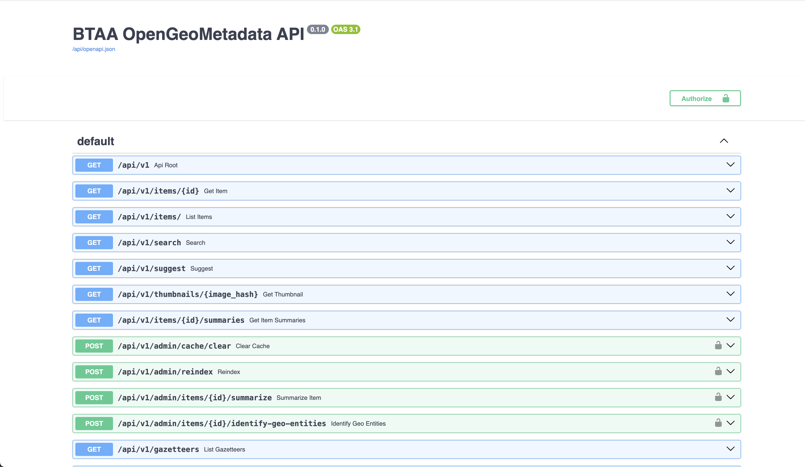

# OpenGeoMetadata API



## Development

Install dependencies using `uv` (recommended):
```bash
# Install uv if you haven't already
curl -LsSf https://astral.sh/uv/install.sh | sh

# Create and activate a virtual environment
uv venv
source .venv/bin/activate

# Install dependencies
uv pip install -e .

# For development dependencies (including testing and linting tools)
uv pip install -e ".[dev]"
```

To generate or update the lockfile:
```bash
uv pip compile pyproject.toml -o uv.lock
```

To install dependencies from the lockfile:
```bash
uv pip install --requirements uv.lock
```

The default settings should work for local development, but if you need to tweak the environment variables, you can do so by copying the `.env.example` file to `.env` and making your changes.

```bash
cp .env.example .env
```

Run the Docker containers:

The application uses several services:

* [PostgreSQL](https://www.postgresql.org/)
  - Port: 2345
  - Default credentials: postgres/postgres
  - Database: btaa_ogm_api

* [Elasticsearch](https://www.elastic.co/elasticsearch/) (Search engine)
  - Port: 9200
  - Single-node configuration
  - Security disabled for development
  - 2GB memory allocation

* [Redis](https://redis.io/) (Caching and message broker)
  - Port: 6379
  - Persistence enabled
  - Used for API caching and Celery tasks

Start all services:
```bash
docker compose up -d
```

Imports a flat file of GeoBlacklight OpenGeoMetadata Aardvark test fixture data:
```bash
cd data
psql -h localhost -p 2345 -U postgres -d btaa_ogm_api -f btaa_ogm_api.txt
```

Run the API server:
```bash
uvicorn main:app --reload
```

## Run the Database migrations

This script will create all the database tables needed for the application.

```bash
.venv/bin/python run_migrations.py
```

## Run the Item Relationships

This script will populate the item_relationships triplestore.

```bash
.venv/bin/python scripts/populate_relationships.py
```

## Run the Elasticsearch index

This script will create and populate the application ES index.

```bash
.venv/bin/python run_index.py
```

## Docker Hub

The application is also available as a Docker image on Docker Hub. You can pull and run the image using the following commands:

```bash
docker pull ewlarson/ogm-api:latest
docker run -d -p 8000:8000 ewlarson/ogm-api:latest
```

This will start the API server on port 8000.

## Endpoints

### GET /docs

[http://localhost:8000/docs](http://localhost:8000/docs)

Returns the API documentation.

## Caching

The API supports aggressive Redis-based caching to improve performance. Caching can be controlled through environment variables:

```
# Enable/disable caching
ENDPOINT_CACHE=true

# Redis connection settings
REDIS_HOST=redis
REDIS_PORT=6379
REDIS_PASSWORD=optional_password
REDIS_DB=0

# Cache TTL settings (in seconds)
DOCUMENT_CACHE_TTL=86400  # 24 hours
SEARCH_CACHE_TTL=3600     # 1 hour
SUGGEST_CACHE_TTL=7200    # 2 hours 
LIST_CACHE_TTL=43200      # 12 hours
CACHE_TTL=43200           # Default TTL (12 hours)
```

When caching is enabled:
- API responses are cached in Redis based on the endpoint and its parameters
- Search results are cached for faster repeated queries
- Document details are cached to reduce database load
- Suggestions are cached to improve autocomplete performance

The cache is automatically invalidated when:
- Documents are created, updated, or deleted
- The Elasticsearch index is rebuilt

You can manually clear the cache using:
```
GET /api/v1/cache/clear?cache_type=search|document|suggest|all
```

## TODO

- [X] Docker Image - Published on Docker Hub
- [X] Search - basic search across all text fields
- [X] Search - autocomplete
- [X] Search - spelling suggestions
- [X] Search - more complex search with filters
- [X] Search - pagination
- [X] Search - sorting
- [X] Search - basic faceting
- [X] Performance - Redis caching
- [ ] Search - facet include/exclude
- [ ] Search - facet alpha and numerical pagination, and search within facets
- [ ] Search - advanced/fielded search
- [ ] Search - spatial search
- [X] Search Results - thumbnail images (needs improvements)
- [X] Search Results - bookmarked items
- [X] Item View - citations
- [X] Item View - downloads
- [X] Item View - relations (triplestore)
- [ ] Item View - exports (Shapefile, CSV, GeoJSON)
- [ ] Item View - export conversions (Shapefile to: GeoJSON, CSV, TSV, etc)
- [ ] Item View - code previews (Py, R, Leaflet)
- [ ] Item View - embeds
- [X] Item View - allmaps integration (via embeds)
- [ ] Item View - data dictionaries
- [ ] Item View - web services
- [ ] Item View - metadata
- [ ] Item View - related items (vector metadata search)
- [ ] Item View - similar images (vector imagery search)
- [ ] Collection View
- [ ] Place View
- [X] Gazetteer - BTAA Spatial
- [X] Gazetteer - Geonames
- [X] Gazetteer - OCLC Fast (Geographic)
- [X] Gazetteer - Who's on First
- [ ] Gazetteer - USGS Geographic Names Information System (GNIS), needed?
- [ ] GeoJSONs
- [X] AI - Metadata summaries
- [X] AI - Geographic entity extraction
- [ ] AI - Subject enhancements
- [ ] AI - Imagery - Summary
- [ ] AI - Imagery - OCR'd text
- [ ] AI - Tabular data summaries
- [ ] API - Analytics (PostHog?)
- [ ] API - Authentication/Authorization for "Admin" endpoints
- [ ] API - Throttling